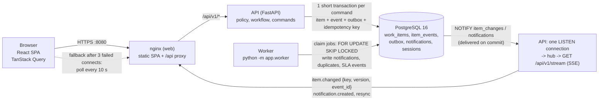

# Architecture

One page. Baton is a modular monolith: one codebase, two Python processes (API, worker), one PostgreSQL.
Postgres is the system of record, the job queue and the search engine (ENGINEERING_DECISIONS 1).



Solid lines exist and are tested. The browser learns of other people's changes from the SSE stream
(ENGINEERING_DECISIONS 52); it carries only keys and versions and the browser refetches through the normal,
authorized API. The dotted line is the 10 s polling fallback.

## What lives where

| Concern | Where | Rule |
|---|---|---|
| Who may do what | `app/domain/policy.py` (pure) | decided on the server; the UI only renders `allowed_actions` |
| What may happen next | `app/domain/workflow.py` (pure) | transition table as data; also mirrored by DB CHECK constraints |
| Visibility | `visibility_clause()` in SQL, `can_view` in Python | in every query that returns items or counts; a test proves they agree |
| One command | `app/services/commands.py`, `db/tx.py` | lock item, policy, workflow, write, `record_event`, commit; no network calls inside |
| History | `item_events` (append-only trigger) | one row per change, same transaction, carries the item version after |
| Async work | `outbox` + `app/worker/` | row written with the change; at least once, idempotent handlers |
| Retries | `Idempotency-Key` stored in the command transaction | same key replays the first answer |

## One command

```mermaid
sequenceDiagram
    participant C as Client
    participant API as API
    participant DB as PostgreSQL
    C->>API: POST /items/PAY-1/claim (Idempotency-Key, If-Match)
    API->>DB: BEGIN; set lock + statement timeouts
    API->>DB: insert idempotency key (ON CONFLICT: replay stored answer)
    API->>DB: SELECT ... FOR UPDATE (item row)
    API->>API: policy (404 / 403), workflow (409 / 422), version (412)
    API->>DB: conditional UPDATE work_items (version + 1)
    API->>DB: INSERT item_events, INSERT outbox, NOTIFY
    API->>DB: COMMIT
    API-->>C: 200 item (or the stored answer on a retry)
```

## Async flow

The worker polls `outbox` (`status = 'pending' AND available_at <= now()`), takes a 60 s lease with
`FOR UPDATE SKIP LOCKED`, runs the handler (`notify`, `duplicates`) and marks the row `done`. A failure backs
off (`2^attempts` s plus jitter); after 8 attempts the row is `dead` and `POST /admin/jobs/{id}/retry`
requeues it. The SLA sweep runs every 60 s under `pg_try_advisory_xact_lock`, so with several workers
exactly one sweeps. If the worker is down, items keep working; notifications arrive late.

## Live updates

The browser polls (`web/src/lib/useLiveUpdates.ts`): every 10 s while the tab is visible it refetches the open
item, its timeline and the lists on screen. Items merge by `(version, last_event_id)`, so a slow response can
never replace newer data. A change by someone else shows up in about 10 s.

## Scaling path: what breaks first

| Order | Breaks first | Why | What I would change |
|---|---|---|---|
| 1 | Stream fan-out | Each open tab is one held connection and one bounded queue per API process; several API processes each hold a LISTEN connection and their own 500-event replay buffer | Replay from `item_events` instead of memory; consider a shared fan-out once a process holds thousands of streams |
| 2 | Hot rows | Every command locks its item row; a very popular item serialises its writers (correct, but a queue) | Nothing for human-speed traffic; if needed, split the comment path from the version lock |
| 3 | List and attention queries | Keyset paging and partial indexes are in place, but the admin's unfiltered sort scans (KNOWN_LIMITATIONS); the "large seed" (50,000 items) was loaded and verified but latency was not benchmarked | Expression indexes for the `due_at` sort, `EXPLAIN` on the large seed, `scripts/bench.py` |
| 4 | Outbox table growth | No cleanup job yet: `done` rows, idempotency keys and sessions are never deleted | The hourly cleanup job from SPEC 9; partition `outbox` by day at high volume |
| 5 | Connections | Each API process and worker holds a pool; a future LISTEN connection must bypass pooling | PgBouncer in transaction mode for requests, a direct connection for LISTEN |
| 6 | Single Postgres | One primary does reads, writes, queue and search | Read replicas for lists and search (the visibility clause is plain SQL); move search to its own index only when ranking needs outgrow `tsvector` |

At 10x (hundreds of users): add SSE, the cleanup job, an `EXPLAIN` pass, and run two API replicas (stateless: sessions
are in Postgres) behind nginx. At 100x: replicas for reads, partitioned `item_events` and `outbox`, a separate
search service if needed, and per-tenant limits. None of this changes the command shape, the event log or the
authorization model.
