# Baton — System Spec

Baton is an internal tool for coordinating operational work: requests that need investigation, action or approval, handed between people and teams until they are resolved.

This file is the source of truth for **what** the system does. `DESIGN.md` covers how it looks. `BUILD_PLAN.md` covers the order it's built in. If code and this spec disagree, the code is wrong — or this spec gets changed on purpose, with a note in `ENGINEERING_DECISIONS.md`.

Sections: [1 Assumptions](#1-assumptions) · [2 Roles](#2-people-and-roles) · [3 Data model](#3-data-model) · [4 Workflow](#4-workflow) · [5 Authorization](#5-authorization) · [6 Concurrency](#6-concurrency-and-consistency) · [7 Attention](#7-attention-and-overview) · [8 Search](#8-search-filtering-pagination) · [9 Async](#9-asynchronous-processing) · [10 Live updates](#10-live-updates) · [11 API](#11-api-contract) · [12 Errors](#12-error-model) · [13 Non-functional](#13-non-functional-targets) · [14 Critical behaviours](#14-critical-behaviours-beyond-crud) · [15 Out of scope](#15-out-of-scope-v1)

---

## 1. Assumptions

Each one goes into the README's Assumptions section, as written.

| # | Assumption | Why it matters |
|---|---|---|
| A1 | Users are employees. Production would use company SSO; v1 uses email + password with seeded accounts. | Auth is real (sessions, hashing, CSRF) but not the focus. |
| A2 | Anyone can raise a request to any team. The receiving team triages it. | Matches "teams receive requests" — the requester is often outside the team. |
| A3 | An item belongs to exactly one team at a time and can be transferred. | Clear accountability; routing mistakes are fixable. |
| A4 | An item has **one owner** at a time. Others collaborate as watchers and commenters. | A single owner is what stops two people silently working the same issue. |
| A5 | Approvals are given by a lead of the owning team, and never by the person who asked for the approval. | Four-eyes rule. |
| A6 | An approval covers the content that was approved. Changing title, description, type or team afterwards needs a fresh approval. | Prevents "approved one thing, executed another". |
| A7 | Due dates default from priority, in calendar hours (no business hours or holidays). | Simple, explainable SLA. |
| A8 | History is never edited or deleted. Corrections are new events. | The audit trail must be trustworthy. |
| A9 | Times are stored in UTC and shown in the browser's local time. UI is English. | — |
| A10 | Desktop first (people at desks working queues); usable on tablet and phone for reading and quick actions. | Shapes layout density. |
| A11 | Notifications are in-app only in v1. Email/Slack would be another consumer of the same outbox. | Async design already supports more channels. |
| A12 | Compliance requests are **confidential** by default: inside the team, only leads, the owner and the requester can see them. | Gives authorization a real resource-level rule. |
| A13 | Any signed-in user can list a team's members and search the user directory. | Needed for routing requests and for assignee and member pickers. |
| A14 | Demo accounts and the shared demo password exist only for the demo seed, and are offered only when `DEMO_MODE=true`. | Real deployments have no well-known credentials; the API refuses demo mode in production. |

---

## 2. People and roles

| Who | How they become it | Typical person |
|---|---|---|
| **Requester** | Raised the item (a relationship, not a role) | Support agent asking Payments to investigate a refund |
| **Viewer** (team role) | Added to a team as viewer | Manager or stakeholder who follows a team's work |
| **Member** (team role) | Added to a team as member | Engineer or analyst who works items |
| **Lead** (team role) | Added to a team as lead | Triage, assignment, approvals, membership |
| **Admin** (org flag) | `users.is_admin` | IT/ops admin: sees everything, manages teams. **Cannot approve** unless also a lead of that team. |

A user can be in several teams with a different role in each (`memberships`). Roles are checked per item, against the item's team.

---

## 3. Data model

PostgreSQL 16. Extensions: `citext`, `pg_trgm`. All timestamps are `timestamptz`. IDs are UUIDs, except append-only logs, which use `bigint identity` (ordering and cursors).

### 3.1 Enums

| Enum | Values |
|---|---|
| `team_role` | `viewer`, `member`, `lead` |
| `item_type` | `incident`, `customer_issue`, `payment_investigation`, `engineering`, `compliance_request`, `ops_task` |
| `item_status` | `new`, `in_progress`, `blocked`, `awaiting_approval`, `resolved`, `closed` |
| `resolution` | `done`, `duplicate`, `wont_do`, `cannot_reproduce` |
| `approval_status` | `pending`, `approved`, `rejected`, `cancelled`, `invalidated` |
| `due_source` | `auto`, `manual` |
| `outbox_status` | `pending`, `done`, `dead` |

Priority is a `smallint` 0–3, shown as P0 (urgent) to P3 (low).

**Type defaults** (set at creation; leads can change them later):

| Type | `requires_approval` | `confidential` |
|---|---|---|
| `payment_investigation` | true | false |
| `compliance_request` | true | **true** |
| `ops_task` | false (requester may turn on) | false |
| others | false | false |

### 3.2 Tables

**users**

| Column | Type | Notes |
|---|---|---|
| id | uuid PK | |
| email | citext UNIQUE | |
| name | text NOT NULL | |
| password_hash | text NOT NULL | argon2id |
| is_admin | bool NOT NULL default false | |
| failed_logins | int NOT NULL default 0 | login throttling |
| locked_until | timestamptz | |
| created_at, deactivated_at | timestamptz | deactivated users can't log in; their history stays |

**teams**

| Column | Type | Notes |
|---|---|---|
| id | uuid PK | |
| key | text UNIQUE, CHECK `^[A-Z]{2,5}$` | immutable; used in item keys |
| name, description | text | |
| item_seq | int NOT NULL default 0 | per-team counter for item numbers |
| created_at | timestamptz | |

**memberships** — PK `(team_id, user_id)`, index `(user_id)`. Columns: `role team_role`, `created_at`.

**work_items**

| Column | Type | Notes |
|---|---|---|
| id | uuid PK | |
| key | text UNIQUE | e.g. `PAY-142`; **never changes**, even after transfer |
| team_id | uuid FK teams | current owning team |
| number | int | UNIQUE `(origin_team_id, number)` |
| origin_team_id | uuid FK | team that issued the key |
| type | item_type | |
| title | text, CHECK length 3–200 | |
| description | text, CHECK length ≤ 20,000 | Markdown, rendered safely |
| priority | smallint, CHECK 0–3 | |
| status | item_status | |
| resolution | resolution NULL | |
| resolution_note | text NULL | |
| duplicate_of_id | uuid FK NULL | set when resolution = duplicate |
| requester_id | uuid FK users | |
| assignee_id | uuid FK users NULL | |
| confidential | bool | |
| requires_approval | bool | |
| due_at | timestamptz NULL | |
| due_source | due_source | |
| sla_breached_at | timestamptz NULL | set once by the SLA sweep |
| last_event_id | bigint NULL | for "what changed last" in lists; set by every event |
| last_activity_at | timestamptz | drives "going stale"; set by events a person wrote, never by system events |
| version | int NOT NULL default 1 | **optimistic concurrency token**; increments only when a decision-relevant field changes (§6.2) |
| created_at, updated_at, resolved_at, closed_at | timestamptz | |
| search | tsvector GENERATED ALWAYS … STORED | see §8 |

Database-enforced rules (CHECK constraints — the last line of defence if application code is wrong):

| Constraint | Rule |
|---|---|
| `owner_when_active` | `status NOT IN ('in_progress','blocked','awaiting_approval') OR assignee_id IS NOT NULL` |
| `resolution_when_done` | `status NOT IN ('resolved','closed') OR resolution IS NOT NULL` |
| `duplicate_has_target` | `resolution IS DISTINCT FROM 'duplicate' OR duplicate_of_id IS NOT NULL` |
| `not_self_duplicate` | `duplicate_of_id IS DISTINCT FROM id` |

Identity rules (a CHECK cannot see the old row, so these are `BEFORE UPDATE` triggers):

| Trigger | Rule |
|---|---|
| `teams_key_immutable` | `teams.key` never changes |
| `work_items_identity_immutable` | `work_items.key`, `number` and `origin_team_id` never change, not even on transfer |

Indexes (each one exists for a named query):

| Index | Serves |
|---|---|
| `(team_id, status, priority, due_at, id)` | team queue, default sort |
| `(team_id, updated_at DESC, id DESC)` | "recently updated" sort |
| `(assignee_id, priority, due_at) WHERE status NOT IN ('resolved','closed')` | "assigned to me" |
| `(team_id, priority, created_at) WHERE assignee_id IS NULL AND status = 'new'` | "needs an owner" |
| `(requester_id, updated_at DESC)` | "my requests" |
| `(due_at) WHERE status NOT IN ('resolved','closed') AND sla_breached_at IS NULL` | SLA sweep |
| `(team_id, last_activity_at) WHERE status IN ('in_progress','blocked')` | going stale |
| GIN `(search)` | full-text search |
| GIN `(title gin_trgm_ops)` | fuzzy title search and duplicate suggestions |

**item_events** — append-only history. This is both the audit trail and the activity feed.

| Column | Type | Notes |
|---|---|---|
| id | bigint identity PK | ordering and cursor |
| item_id | uuid FK | |
| team_id | uuid FK | the item's team **after** the change: every event of a command carries the team the item has when the command ends. For a transfer, all of its events carry the new team |
| actor_id | uuid FK NULL | NULL = system (worker) |
| kind | text, CHECK in the event list below | |
| item_version | int | item version **after** this change. Events that do not change a versioned field (`commented`, `sla_breached`, `duplicate_suggested`) carry the item's **current** version |
| data | jsonb | `{field: {from, to}}` and kind-specific detail |
| reason | text NULL | required for decisions (see §4) |
| is_decision | bool | true for the kinds marked ★ below |
| request_id | text | correlates with logs |
| created_at | timestamptz | |

Indexes: `(item_id, id DESC)`, `(team_id, id DESC) WHERE is_decision`, BRIN `(created_at)`.
A trigger raises an error on any `UPDATE` or `DELETE` of this table.

Event kinds: `created`, `field_changed`, `priority_changed` (★ when lowered from P0/P1), `assigned`, `unassigned`, `status_changed` (★ for close/reopen), `blocked`, `unblocked`, `resolved` ★, `reopened` ★, `closed` ★, `transferred` ★, `approval_requested`, `approval_approved` ★, `approval_rejected` ★, `approval_cancelled`, `approval_invalidated` ★, `requires_approval_changed` ★ (when turned off), `confidential_changed` ★, `commented`, `sla_breached`, `duplicate_suggested`.

**comments** — `id bigint identity`, `item_id`, `author_id`, `body text CHECK length 1–10,000`, `created_at`. Append-only in v1 (no edit or delete). Each comment also writes a `commented` event, so the timeline reads from one stream.

**approvals**

| Column | Type | Notes |
|---|---|---|
| id | uuid PK | |
| item_id | uuid FK | |
| status | approval_status | |
| requested_by | uuid FK | |
| requested_at | timestamptz | |
| request_note | text NULL | |
| subject_hash | text | sha256 of the item's **material fields** when requested: `team_id, type, title, description` |
| decided_by | uuid FK NULL | |
| decided_at | timestamptz NULL | |
| decision_note | text NULL | required on rejection |
| invalidated_reason | text NULL | |

Constraints: UNIQUE `(item_id) WHERE status = 'pending'` (one open request per item) · CHECK `decided_by IS DISTINCT FROM requested_by` (four-eyes, enforced by the database).

**watchers** — PK `(item_id, user_id)`. Requester, assignee and commenters are added automatically.

**item_reads** — PK `(user_id, item_id)`, `last_read_event_id bigint`, `read_at`. Upserted when a user opens an item: the newest event they had seen. Events with a greater id are "updated since you looked" (comments included, because they carry no version of their own).

**notifications** — `id bigint identity`, `user_id`, `item_id`, `event_id`, `kind`, `created_at`, `read_at`. UNIQUE `(user_id, event_id)` makes fan-out idempotent. Index `(user_id, id DESC) WHERE read_at IS NULL`.

**item_similar** — PK `(item_id, similar_item_id)`, `score real`, `created_at`. Output of the duplicate-detection job.

**idempotency_keys** — PK `(user_id, key)`, `fingerprint text` (sha256 of method + path + canonical body), `response_status int`, `response_body jsonb`, `created_at`. Index `(created_at)` for cleanup.

**outbox** — `id bigint identity`, `topic text`, `payload jsonb`, `dedupe_key text UNIQUE NULL`, `status outbox_status`, `attempts int`, `available_at`, `locked_until`, `last_error text`, `created_at`, `processed_at`. Partial index `(available_at, id) WHERE status = 'pending'`.

**sessions** — `id text PK` (sha256 of the token, never the token itself), `user_id`, `created_at`, `expires_at`, `last_seen_at`, `user_agent`.

---

## 4. Workflow

One pure module (`api/app/domain/workflow.py`) owns every rule here. It takes the item, the actor's relationship to it and the requested action, and returns *allowed* or a *violation with a code*. It does no I/O. The API uses it to enforce rules; it also computes `allowed_actions` for the UI, so the UI never re-implements a rule.

```mermaid
stateDiagram-v2
    [*] --> new: create
    new --> in_progress: claim / assign
    in_progress --> new: release / unassign
    in_progress --> blocked: block (reason)
    blocked --> in_progress: unblock
    blocked --> new: release / unassign
    in_progress --> awaiting_approval: request approval
    awaiting_approval --> in_progress: approve / reject (reason) / cancel / invalidated by edit
    in_progress --> resolved: resolve (note; approval if required)
    resolved --> in_progress: reopen (reason)
    resolved --> new: reopen (previous owner no longer on the team)
    new --> closed: close (resolution, reason) / withdraw (requester)
    in_progress --> closed: close (resolution, reason)
    blocked --> closed: close (resolution, reason)
    resolved --> closed: close
    closed --> in_progress: reopen (lead, reason)
    closed --> new: reopen (previous owner no longer on the team)
```



### 4.1 Transitions

| Action | From → To | Who | Required | Side effects |
|---|---|---|---|---|
| `claim` | new → in_progress | member, lead | item unassigned | `assigned` + `status_changed`; watcher added |
| `release` | in_progress, blocked → new | current assignee | — | `unassigned`, `status_changed` |
| `assign` | any open → in_progress (or unchanged if already active) | lead | target is member or lead of the team | `assigned`; old assignee notified |
| `unassign` | in_progress, blocked → new | lead | — | `unassigned` |
| `block` | in_progress → blocked | assignee, lead | reason | `blocked` |
| `unblock` | blocked → in_progress | assignee, lead | — | `unblocked` |
| `request_approval` | in_progress → awaiting_approval | assignee, lead | no pending approval | creates `approvals` row with `subject_hash` |
| `approve` | awaiting_approval → in_progress | lead, **≠ requested_by** | `If-Match` = version the approver reviewed | approval `approved` |
| `reject` | awaiting_approval → in_progress | lead, ≠ requested_by | reason, `If-Match` | approval `rejected` |
| `cancel_approval` | awaiting_approval → in_progress | requested_by, lead | — | approval `cancelled` |
| `resolve` | in_progress → resolved | assignee, lead | resolution note; **if `requires_approval`: an `approved` approval whose `subject_hash` matches the current content** | `resolved` |
| `reopen` | resolved → in_progress | requester, assignee, lead | reason | `reopened` |
| `reopen` | closed → in_progress | lead | reason | `reopened` |
| `close` | new, in_progress, blocked → closed | lead | resolution + reason; `duplicate_of` if duplicate | `closed` |
| `withdraw` | new → closed | requester | reason; resolution `wont_do` | `closed` |
| `close` | resolved → closed | lead, requester | — | `closed` |
| `transfer` | any open state | lead of current team | target team, reason | see 4.3 |

**Reopen target:** an item goes back to `in_progress` with its previous owner if that person is still a member or lead of the team; otherwise it goes to `new`, unassigned. Reopen lands in `new` when there is no valid previous owner, because `owner_when_active` forbids `in_progress` without one.

`release`, `assign` and `unassign` are not allowed while `awaiting_approval`; cancel the approval first.

### 4.2 Field edits (PATCH)

| Field | Who may change it | Rule |
|---|---|---|
| title, description | requester (until resolved), assignee, lead | **material field** — invalidates approvals (4.4) |
| type | lead | material; re-applies type defaults only if the lead asks |
| priority | member, lead; requester only while `new` and unassigned | lowering from P0/P1 needs a reason (decision event) |
| due_at | lead | sets `due_source = manual` |
| confidential | lead | decision event |
| requires_approval | turn on: assignee, lead · turn off: lead only, with reason | turning off is a decision event |

`requires_approval` cannot be changed while the item is `awaiting_approval`; cancel the approval first.

When priority changes and `due_source = auto`, `due_at` is recomputed from `created_at`. Defaults: P0 4 h · P1 24 h · P2 3 days · P3 7 days.

### 4.3 Transfer

1. `team_id` changes; `key` does not.
2. If the assignee is not a member or lead of the target team, they are unassigned and the status goes back to `new`.
3. A pending approval is cancelled (reason "transferred"); an approved one is invalidated (team is a material field).
4. The previous team's members lose access unless they are the requester. The live-update payload includes `prev_team_id` so their screens drop the item.

### 4.3b Membership changes

Removing someone from a team, demoting them to viewer, or deactivating their account unassigns their open items in that team in the same transaction. Those items go back to `new` with an `unassigned` event (reason "Removed from Payments" or similar), so no item is left owned by someone who can't work it. Items awaiting approval are the exception: the pending approval is cancelled first, with the same reason.

### 4.4 Approval binding (stale-approval protection)

- An approval records `subject_hash` of the material fields.
- A PATCH that changes a material field, in the same transaction: sets a `pending` approval to `invalidated` and moves the item from `awaiting_approval` back to `in_progress`; sets the latest `approved` approval to `invalidated`. It writes an `approval_invalidated` event naming the fields that changed.
- `approve` requires `If-Match`. If the item changed after the approver opened it, they get `412 VERSION_CONFLICT` with the changes, and must review before approving.
- Both the edit and the approve lock the item row first (§6.4), so they can't interleave: either the approval lands first and the edit then invalidates it, or the edit lands first and the approval fails with 412.

### 4.5 Next step (shown on every item)

The API computes `next_step: {kind, label, severity}` for each item and viewer, first match wins:

| Condition | Label (example) | Severity |
|---|---|---|
| awaiting approval and viewer can approve | "Needs your approval" | high |
| awaiting approval | "Waiting for a Payments lead to approve" | medium |
| SLA breached | "Overdue by 3 h" | high |
| unassigned and open | "Needs an owner" | high if P0/P1, else medium |
| blocked | "Blocked: waiting on bank response" | medium |
| no activity for 72 h while active | "No activity for 4 days" | medium |
| due within 4 h | "Due in 2 h" | medium |
| resolved | "Resolved, ready to close" (lead) / "Confirm it's fixed" (requester) | low |
| otherwise | "In progress with Asha" | low |

---

## 5. Authorization

Authorization lives in one pure module (`api/app/domain/policy.py`) plus one SQL predicate builder. The UI hides controls as a convenience only; every request is checked on the server.

### 5.1 Who can see an item

A user can see an item if **any** of these is true:

1. they are an admin;
2. they are the requester;
3. they are in the item's team **and** (the item is not confidential **or** they are a lead **or** they are the assignee).

The same rule exists in two forms that must agree:

- `policy.can_view(ctx, item) -> bool` for single items;
- `visibility_clause(ctx) -> SQL` used in **every** query that returns items or counts: list, search, facets, attention, dashboard stats, decision log, similar-items, notifications, and the live-update filter.

A property test checks that they agree on seeded data (§14, T-VIS).

An item the user can't see returns **404**, never 403, so its existence doesn't leak. An item they can see but can't act on returns **403** with a reason ("Only Payments leads can approve").

### 5.2 Permission matrix

✓ allowed · ✗ not allowed · R only if requester · A only if assignee

| Action | Viewer | Member | Lead | Requester (not in team) | Admin (not in team) |
|---|---|---|---|---|---|
| See item (non-confidential) | ✓ | ✓ | ✓ | R | ✓ |
| See item (confidential) | ✗ | A | ✓ | R | ✓ |
| Raise an item in any team | ✓ | ✓ | ✓ | ✓ | ✓ |
| Comment, watch | ✓ | ✓ | ✓ | R | ✓ |
| Edit title/description | ✗ | A | ✓ | R (until resolved) | ✗ |
| Change priority | ✗ | ✓ | ✓ | R (while new and unassigned) | ✗ |
| Claim / release | ✗ | ✓ / A | ✓ / A | ✗ | ✗ |
| Assign others, unassign | ✗ | ✗ | ✓ | ✗ | ✗ |
| Block, unblock, resolve | ✗ | A | ✓ | ✗ | ✗ |
| Request approval | ✗ | A | ✓ | ✗ | ✗ |
| Approve / reject | ✗ | ✗ | ✓ (not own request) | ✗ | ✗ |
| Cancel an approval request | ✗ | if they requested it | ✓ | ✗ | ✗ |
| Reopen resolved | ✗ | A | ✓ | R | ✗ |
| Close, reopen a closed item, transfer, edit due date, confidential, type | ✗ | ✗ | ✓ | ✗ (requester may close a resolved item or withdraw a new one) | ✗ |
| Manage members/viewers | ✗ | ✗ | ✓ | — | ✓ |
| Manage leads, create teams | ✗ | ✗ | ✗ | — | ✓ |
| View jobs and dead letters | ✗ | ✗ | ✗ | — | ✓ |

### 5.3 Actor context

Loaded fresh from the database on every request: user, `is_admin`, `{team_id: role}`. Nothing about roles is cached in the session cookie, so removing someone from a team takes effect on their next request.

### 5.4 Sessions and request safety

| Concern | Mechanism |
|---|---|
| Passwords | argon2id |
| Session | 32-byte random token in `baton_session` cookie (HttpOnly, SameSite=Lax, Secure when HTTPS); only its sha256 stored; 12 h idle expiry |
| CSRF | double-submit: readable `baton_csrf` cookie must equal `X-CSRF-Token` header on every unsafe method |
| Login throttling | 5 failures → 15-minute lock per account; same message for unknown email and wrong password |
| Untrusted content | Markdown rendered without raw HTML; strict Content-Security-Policy from nginx |
| SQL | parameters only, never string-built values |

---

## 6. Concurrency and consistency

### 6.1 Two people take the same item — atomic claim

```sql
UPDATE work_items
   SET assignee_id = :me,
       status = CASE WHEN status = 'new' THEN 'in_progress' ELSE status END,
       version = version + 1, updated_at = now(), last_activity_at = now()
 WHERE id = :id AND assignee_id IS NULL AND status = 'new'
RETURNING *;
```

- One row returned → this request won. Write the events in the same transaction.
- Zero rows → read the item: already mine → `200` (claiming twice is not an error); someone else's → `409 ALREADY_CLAIMED` with the current owner and when they took it.
- Under READ COMMITTED, a concurrent `UPDATE` waits for the row lock, then re-checks the `WHERE` against the committed row, so exactly one claim wins. No application-level lock is needed.

### 6.2 Someone edits from an old view — optimistic versions

- `GET /items/{id}` returns `ETag: "<version>"`.
- `PATCH` and intent-dependent commands **require** `If-Match: "<version>"` (`428` if missing).
- The update runs `… WHERE id = :id AND version = :expected`. Zero rows → `412 VERSION_CONFLICT` with `current` (the item now) and `changes_since` (the versioned events after the expected version: `item_version > expected`, excluding the kinds below that never bump). The client uses `changes_since` to show exactly what changed.

**What the version counts.** `version` is the item's decision-relevant state: title, description, type, priority, status, assignee, team, due_at, confidential, requires_approval, approval state (requested, approved, rejected, cancelled, invalidated) and resolution. A command that changes any of them increments `version` by exactly 1, however many events it writes; all of its events carry the new version.

Some writes must not make everyone else's `If-Match` stale, so they **never bump** `version`:

| Write | Event row | Updates | Version |
|---|---|---|---|
| comment | `commented` | `last_event_id`, `last_activity_at` | unchanged; `item_version` = current |
| `duplicate_suggested` (worker) | yes | `last_event_id` | unchanged; `item_version` = current |
| `sla_breached` (worker) | yes | `last_event_id`, `sla_breached_at` | unchanged; `item_version` = current |
| watch / unwatch | none (no event kind) | only `watchers` | unchanged |

System events leave `last_activity_at` alone, so a machine-written event never resets "going stale". Every event also sets `updated_at`.

| Command | Needs `If-Match`? | Why |
|---|---|---|
| PATCH, assign, unassign, transfer, block, unblock, resolve, reopen, close, request/approve/reject approval | Yes | the user decided based on what they saw |
| claim, release (own), comment, watch, cancel own approval | No | the condition is checked by the operation itself |

### 6.3 Repeated requests — idempotency keys

Every `POST` that creates or changes something accepts `Idempotency-Key` (required on `POST /items` and comments). The client creates the key **when the user acts**, and reuses it for every automatic retry and every double-click of that action.

Server flow, in **one** transaction:

1. `INSERT INTO idempotency_keys (user_id, key, fingerprint) … ON CONFLICT DO NOTHING`.
   - If another request with the same key is still running, Postgres makes this insert wait until that transaction finishes.
2. Inserted → run the command inside a `SAVEPOINT`.
   - Success → store status + body on the key row → commit.
   - Domain error (4xx) → roll back to the savepoint, store the error response, commit. A retry gets the same answer.
   - Unexpected error (5xx) → roll back everything, including the key row, so a retry runs again.
3. Not inserted (key exists) → different fingerprint → `422 IDEMPOTENCY_KEY_REUSED`; same fingerprint → replay the stored status and body with `Idempotent-Replayed: true`.

Keys expire after 24 h (cleanup job).

The web client sends a key with **every** mutation, PATCH included. Without one, a retried PATCH whose first response was lost would hit `412` against its own earlier change; with one, the retry gets the original `200` replayed.

### 6.4 Command transaction shape

Every command is one short transaction:

```
BEGIN
  idempotency insert (6.3)
  SELECT … FROM work_items WHERE id = :id FOR UPDATE      -- lock order: item first, then approvals
  load actor context; policy check; workflow check
  apply change (version = version + 1, only when a versioned field changed, §6.2)
  for each event the command writes (one per change), through record_event():
    INSERT item_events (item_version = the new version, or the current
                        version for commented / sla_breached / duplicate_suggested)
    UPDATE work_items.last_event_id (and last_activity_at for events a person wrote)
    INSERT outbox (topic 'item.event', payload {event_ids: [this event], request_id})
    NOTIFY item_changes '{…}'                              -- delivered only if the transaction commits
  store idempotency response
COMMIT
```

- No network calls inside a transaction.
- `SET LOCAL lock_timeout = '2s'` and `statement_timeout = '5s'`. A timeout returns `503 BUSY` with `Retry-After`, which is safe to retry because of 6.3.
- Serialization failures and deadlocks (SQLSTATE `40001`, `40P01`) retry the whole transaction up to 3 times.
- Unique-constraint violations are translated into domain errors (e.g. a second pending approval → `409 APPROVAL_ALREADY_PENDING`).

### 6.5 Many updates in a short time

- Writes to one item serialize on its row lock; versions make every lost update visible as a 412.
- **One user firing several actions quickly** (priority, then status) would conflict with themselves, because the second request carries the old version. The client runs mutations for the same item one after another (TanStack Query mutation `scope: {id: 'item:<id>'}`), each using the version returned by the previous one.
- Live-update events are coalesced on the client (one refetch per item per 250 ms). *(SSE design; v1 polls once per 10 s tick, so there is nothing to coalesce.)*
- Item numbers come from `UPDATE teams SET item_seq = item_seq + 1 … RETURNING`, which locks the team row for the instant of a create. That's fine at this scale; per-team sequences are the growth path.

### 6.6 Reconciling the browser with the server

- The server response is always the truth. After any mutation, the item cache is replaced with the server's item.
- **Version guard:** an incoming item (refetch, live update, mutation response) replaces the cached one only if `(incoming.version, incoming.last_event_id) >= (cached.version, cached.last_event_id)`, compared in that order. Comments do not change `version`, so `last_event_id` breaks the tie. Out-of-order responses can't roll the screen back.
- **Optimistic where conflicts are rare** (watch, comment, priority): apply at once, roll back on error.
- **Pending-then-confirmed where conflicts are the point** (claim, approve, resolve): show the button as working, then the server's decision. A claim that loses shows who took it.
- **Automatic rebase on 412** for field edits: if the fields I changed and the fields they changed don't overlap, re-send my change on the new version and say so ("Saved. Asha's change to priority was kept."). If they overlap, open the conflict dialog.

---

## 7. Attention and overview

`GET /me/attention` returns these sections. Each is its own indexed query with a limit, so the cost doesn't grow with history.

| Section | Rule | Order |
|---|---|---|
| Needs your approval | pending approvals in teams where you're lead, not requested by you | oldest request first |
| Yours, overdue or urgent | assigned to you, open, and (SLA breached or P0/P1) | priority, then due |
| Needs an owner | unassigned `new` items in your teams (member/lead) | priority, then age |
| Yours, going quiet | assigned to you, active, no activity for 72 h | least recent first |
| Your requests | items you raised with activity since you last opened them | most recent first |

Each section returns `count` (capped at 100 and shown as "100+") and the first 10 items.

**Dashboard** (`GET /stats/teams`; **not built in v1**, ENGINEERING_DECISIONS 50), per visible team: open items by priority, unowned, overdue, awaiting approval, median age of open items, created vs. resolved per day for 14 days, and the 5 oldest open items. All counts use the visibility rule, so different people can see different numbers.

**Decision log** (`GET /decisions`; **not built in v1**, ENGINEERING_DECISIONS 50): events with `is_decision = true` and their reasons, newest first, filterable by team. This answers "why was this decided?"

---

## 8. Search, filtering, pagination

**Filters** (all combinable, all reflected in the page URL): `team`, `status[]`, `priority[]`, `type[]`, `assignee` (`me` | `none` | id), `requester` (`me` | id), `overdue`, `confidential`, `updated_since`, `q`.

**Sorts**: `priority` (priority, due_at, id) · `updated` (updated_at desc, id) · `created` (created_at desc, id) · `due` (due_at, id). Null `due_at` sorts last via `COALESCE(due_at, 'infinity')`, and the cursor uses the same expression.

**Keyset pagination**: `limit` (default 50, max 100) and an opaque `cursor` (base64 JSON of the last row's sort values and id). No `OFFSET`. No total count on lists; `GET /items/facets` returns counts per status, priority, type and team for the same filters.

**Full-text search**:

```sql
search tsvector GENERATED ALWAYS AS (
  setweight(to_tsvector('simple',  coalesce(key, '')), 'A') ||
  setweight(to_tsvector('english', title), 'A') ||
  setweight(to_tsvector('english', coalesce(description, '')), 'B')
) STORED
```

- `q` that looks like a key (`PAY-142`) → exact key lookup first.
- Otherwise `websearch_to_tsquery('english', q)`, ranked by `ts_rank`, plus trigram similarity on the title for typos. Search returns the top 50 ranked results (no deep paging for ranked search, by design).

**Similar items** (`GET /items/similar?team_id&title`): open items in that team with `similarity(title, :title) > 0.35`, top 5. The create form shows these while you type.

---

## 9. Asynchronous processing

The user's action is complete when its transaction commits. Secondary work happens after, from the **transactional outbox**: a row written in the same transaction as the change, so work can't be lost or invented by a rollback.

**Worker** (separate process, same codebase):

```sql
UPDATE outbox SET locked_until = now() + interval '60 seconds', attempts = attempts + 1
 WHERE id IN (SELECT id FROM outbox
               WHERE status = 'pending' AND available_at <= now()
                 AND (locked_until IS NULL OR locked_until < now())
               ORDER BY id FOR UPDATE SKIP LOCKED LIMIT 50)
RETURNING *;
```

- Several workers can run at once; `SKIP LOCKED` hands each job to one of them.
- A worker that crashes mid-job stops renewing its lease, so the job becomes available again after 60 s. That makes delivery **at least once**, and every handler is idempotent.
- On failure: `available_at = now() + min(2^attempts, 300) s` plus jitter. After 8 attempts, `status = 'dead'`, shown on the admin Jobs page with the error and a Retry button.
- The UI never depends on async work for correctness. If the worker stops, items still work; notifications arrive late.

| Topic / job | Trigger | What it does | Why running it twice is safe |
|---|---|---|---|
| `item.event` → notify | every committed event (one outbox row per event) | notifications for assignee, watchers and requester (not the actor) | UNIQUE `(user_id, event_id)` |
| `item.created` → duplicates | item created | finds similar open items (trigram) → `item_similar` + one `duplicate_suggested` event | upsert; event dedupe key `dup:<item_id>` |
| SLA sweep | every 60 s | `UPDATE work_items SET sla_breached_at = now() WHERE due_at < now() AND sla_breached_at IS NULL AND status NOT IN ('resolved','closed') RETURNING …` → event + notifications | the `IS NULL` guard makes the update happen once per item |
| Cleanup (**not built in v1**) | hourly | delete idempotency keys > 24 h, expired sessions, `done` outbox rows > 7 days | deletes are naturally idempotent |

Scheduled jobs run inside `pg_try_advisory_xact_lock(<job id>)`, so with several workers only one runs each sweep. Running the scheduler inside every API worker would fire jobs once per worker (the ClinicQ lesson).

Dev-only fault injection (**v1: the setting is read and refused in prod, but the handler does not use it yet**): `FAULT_NOTIFY_FAIL_RATE=0.3` makes the notify handler fail randomly, to demonstrate retries and dead letters. The app refuses to start with it set when `ENV=prod`.

---

## 10. Live updates

> **v1 as built: polling, not SSE** (ENGINEERING_DECISIONS 50). The web client refetches the open item, its timeline and the lists on screen every 10 s while the tab is visible (`web/src/lib/useLiveUpdates.ts`), merging by `(version, last_event_id)`. `NOTIFY item_changes` and `NOTIFY notifications` are already sent inside each command's transaction, but nothing listens, and `GET /stream` does not exist. The rest of this section is the design for the SSE replacement, which would change only the body of `useLiveUpdates`.

- `GET /api/v1/stream` is a Server-Sent Events stream.
- Each API process keeps **one** dedicated `LISTEN item_changes` connection and fans out to its connected clients through bounded in-memory queues.
- NOTIFY payload (well under Postgres's 8,000-byte limit): `{event_id, item_id, version, team_id, prev_team_id, requester_id, assignee_id, confidential}`. No content: clients refetch through the normal, authorized API.
- Each client's events are filtered with the same visibility rule as §5.1, using that client's actor context (refreshed every 60 s).
- SSE `id:` is the `event_id`. On reconnect, the browser sends `Last-Event-ID`; the server replays visible events since then from `item_events` (up to 500). If more were missed, it sends `resync` and the client refetches everything on screen.
- A slow client whose queue fills up gets `resync` and the backlog is dropped, so one slow browser can't hold memory.
- Heartbeat comment every 15 s. Response headers `Cache-Control: no-cache` and `X-Accel-Buffering: no`; nginx has `proxy_buffering off` for this path.
- Event types: `item.changed {id, version, event_id}`, `notification.created {unread}`, `resync`.
- The listener connection must be a direct Postgres connection; LISTEN doesn't work through a transaction-mode pooler such as PgBouncer.

---

## 11. API contract

Base path `/api/v1`. JSON. OpenAPI generated by FastAPI at `/api/docs`; the frontend's TypeScript types are generated from it.

| Method | Path | Purpose | Idempotency-Key | If-Match |
|---|---|---|---|---|
| POST | `/auth/login` | sign in, set cookies | — | — |
| POST | `/auth/logout` | end session | — | — |
| GET | `/me` | user, memberships, CSRF token | — | — |
| GET | `/me/attention` | attention sections (§7) | — | — |
| GET | `/me/notifications` | paginated | — | — |
| POST | `/me/notifications/read` | mark ids or all read | optional | — |
| GET | `/teams` | all teams (to route requests) | — | — |
| GET | `/teams/{key}/members` | members and roles | — | — |
| POST, PATCH, DELETE | `/teams/{key}/members[/{user_id}]` | manage membership | optional | — |
| GET | `/users?q=` | directory search for pickers (paginated) | — | — |
| POST | `/items` | create | **required** | — |
| GET | `/items` | list with filters, sort, cursor | — | — |
| GET | `/items/facets` | counts for the same filters | — | — |
| GET | `/items/similar` | possible duplicates while typing | — | — |
| GET | `/items/{key}` | item + `allowed_actions` + `next_step` + `ETag` | — | — |
| PATCH | `/items/{key}` | edit fields | optional | **required** |
| POST | `/items/{key}/claim` | take ownership | optional | — |
| POST | `/items/{key}/release` | give up ownership | optional | — |
| POST | `/items/{key}/assign` | set or clear owner | optional | required |
| POST | `/items/{key}/transition` | `{action, reason?, resolution?, duplicate_of?}` | optional | required |
| POST | `/items/{key}/transfer` | `{team_key, reason}` | optional | required |
| POST | `/items/{key}/approvals` | request approval | optional | required |
| POST | `/items/{key}/approvals/{id}/decision` | `{decision, note}` | optional | **required** |
| POST | `/items/{key}/approvals/{id}/cancel` | cancel own request | optional | — |
| GET | `/items/{key}/events` | timeline, paginated; `after_event_id` | — | — |
| POST | `/items/{key}/comments` | add comment | **required** | — |
| PUT, DELETE | `/items/{key}/watch` | watch, unwatch | — | — |
| POST | `/items/{key}/read` | record that I've seen up to this event (the item's current `last_event_id`) | — | — |
| GET | `/stats/teams` | dashboard numbers (**not built in v1**) | — | — |
| GET | `/decisions` | decision log (**not built in v1**) | — | — |
| GET | `/stream` | live updates (SSE) (**not built in v1; the client polls**) | — | — |
| GET | `/admin/jobs` | outbox by status | — | — |
| POST | `/admin/jobs/{id}/retry` | requeue a dead job | optional | — |
| GET | `/healthz`, `/readyz` | liveness; readiness (DB reachable, migrations at head) | — | — |
| GET | `/demo/users` | quick account switcher, **only when `DEMO_MODE=true`** | — | — |

**Item response** (abridged):

```json
{
  "id": "…", "key": "PAY-142", "version": 7, "last_event_id": 90412,
  "team": {"key": "PAY", "name": "Payments"},
  "type": "payment_investigation", "title": "Refund stuck for order 48213",
  "status": "awaiting_approval", "priority": 1, "confidential": false,
  "requires_approval": true,
  "requester": {"id": "…", "name": "Meera Iyer"},
  "assignee": {"id": "…", "name": "Asha Rao"},
  "due_at": "…", "sla_breached": false,
  "approval": {"id": "…", "status": "pending", "requested_by": {"…": "…"}, "requested_at": "…"},
  "next_step": {"kind": "approval", "label": "Needs your approval", "severity": "high"},
  "allowed_actions": ["approve", "reject", "comment", "watch"],
  "last_event": {"kind": "approval_requested", "actor": {"name": "Asha Rao"}, "at": "…"},
  "unread_since_event_id": 90377,
  "created_at": "…", "updated_at": "…"
}
```

---

## 12. Error model

Every error is `application/problem+json` (RFC 9457) with `type`, `title`, `status`, `detail`, plus `code`, `request_id`, and when useful `errors[]` (field errors), `current` (the item now) and `changes_since`.

| HTTP | `code` | When | What the client does |
|---|---|---|---|
| 400 | `VALIDATION_FAILED` | bad input | show field errors inline |
| 401 | `UNAUTHENTICATED` | no or expired session | go to login, keep the return path |
| 403 | `FORBIDDEN` | visible but not permitted (`detail` says why) | toast with the reason |
| 403 | `CSRF_FAILED` | missing or wrong token | refetch `/me`, retry once |
| 404 | `NOT_FOUND` | missing or not visible | "This item doesn't exist or you no longer have access" |
| 405 | `METHOD_NOT_ALLOWED` | wrong HTTP method for a path | show a generic error; a client bug |
| 409 | `ALREADY_CLAIMED` | lost a claim race | roll back; "Asha took this 4 seconds ago" |
| 409 | `WORKFLOW_VIOLATION` | action not valid from the current state | refresh item; explain using `current.status` |
| 409 | `APPROVAL_ALREADY_PENDING` | second approval request | refresh item |
| 412 | `VERSION_CONFLICT` | `If-Match` doesn't match | rebase or conflict dialog (§6.6) |
| 422 | `APPROVAL_REQUIRED` | resolve without a valid approval | point to "Request approval" |
| 422 | `REASON_REQUIRED` | decision without a reason | focus the reason field |
| 422 | `IDEMPOTENCY_KEY_REUSED` | same key, different request | bug: log it; new key on the next user action |
| 428 | `PRECONDITION_REQUIRED` | `If-Match` missing | bug in client |
| 429 | `RATE_LIMITED` | login throttled | show when to try again |
| 503 | `BUSY` | lock or statement timeout | automatic retry with the same idempotency key |
| 500 | `INTERNAL` | unexpected | toast with `request_id`; nothing half-saved |

---

## 13. Non-functional targets

Targets, to be measured on a laptop in Docker against the large seed (§13.1). **v1: not measured** (no `docs/PERFORMANCE.md`, no `scripts/bench.py`); the large seed loads and every history verifies, and one `EXPLAIN` finding is in ENGINEERING_DECISIONS 32.

| Measure | Target |
|---|---|
| `GET /items` (filtered, first page) p95 | < 150 ms |
| `GET /items/{key}` p95 | < 100 ms |
| Search p95 | < 250 ms |
| `GET /me/attention` p95 | < 200 ms |
| Commands (claim, PATCH, transition) p95 | < 150 ms |
| First load of the app (production build, cached API) | < 2 s; initial JS < 250 kB gzipped |
| Scroll through 1,000 list rows | stays smooth (virtualized) |
| No request-path query on `work_items` or `item_events` | sequential scan (checked with `EXPLAIN`) |

### 13.1 Seed sizes

| Seed | Users | Teams | Items | Events | Comments |
|---|---|---|---|---|---|
| `demo` (default) | 24 named personas | 6 | ~600 | ~5,000 | ~1,200 |
| `large` | 2,000 | 40 | 50,000 (~18,000 open) | ~600,000 | ~120,000 |

Seeded histories must be valid paths through the workflow; a test replays a sample through `workflow.py`.

**Demo teams**: Payments (PAY), Customer Support (SUP), Platform & SRE (SRE), Compliance (CMP), Finance Ops (FIN), Core Engineering (ENG). Every demo persona has a clear role, e.g. `priya.lead@baton.test` (Payments lead), `asha@baton.test` (Payments member), `rahul@baton.test` (Payments member), `meera@baton.test` (Support member, frequent requester), `dev.viewer@baton.test` (viewer on Payments and SRE), `admin@baton.test`. One shared demo password, shown on the login page only in demo mode.

---

## 14. Critical behaviours beyond CRUD

The brief asks for at least three. Baton covers all seven of its examples. Each has a mechanism, a test that fails if the guard is removed, and a demo moment.

| # | Situation | Mechanism | Test (must go red if the guard is removed) | Demo |
|---|---|---|---|---|
| CB1 | Two people take responsibility at once | conditional UPDATE (§6.1) | T-CLAIM: 20 concurrent claims → exactly 1 win, 19 × 409, exactly 1 `assigned` event | two windows, click together |
| CB2 | Someone acts on stale information | versions + If-Match + `changes_since` (§6.2) | T-STALE: two PATCHes on version 3 → one 200, one 412; version ends at 4 | conflict dialog |
| CB3 | A request repeated because the user wasn't sure | idempotency in the same transaction (§6.3) | T-IDEM: 10 concurrent creates, one key → 1 item, 10 identical bodies; same key + different body → 422 | network throttled, double-click Create |
| CB4 | Workflow rules | `workflow.py` + DB constraints (§4) | T-FLOW: every action × state × role checked against the table; resolve without approval → 422 | try to resolve a payment item |
| CB5 | Approved content changes | subject hash + invalidation + approve needs If-Match (§4.4) | T-APPROVE-RACE: approve and edit at the same moment → never "approved" on content the approver didn't see | edit while a lead is reviewing |
| CB6 | Resource-level authorization | policy + one SQL visibility clause (§5) | T-VIS: for random users, every list/search/count/stream result passes `can_view`, and every viewable item is reachable | a viewer calls the API directly |
| CB7 | Reliable async processing | outbox + SKIP LOCKED + idempotent handlers (§9) | T-OUTBOX: two workers, 500 jobs → each processed once; a crash mid-job → retried; duplicate delivery → one notification | stop the worker, keep working, restart it |
| CB8 | Optimistic UI vs. server decision | version guard, per-item mutation queue, rebase (§6.6) | T-RECONCILE (unit): stale response ignored; 409 rolls back; disjoint 412 rebased | live update while editing |

---

## 15. Out of scope (v1)

Written up as known limitations, each with what it would take: SSO; email/Slack notifications; attachments; @mentions; editing or deleting comments; bulk actions; searching comments; custom workflows per team; business-hours SLA calendars; real-time co-editing of text (conflicts are detected and shown, not merged); materialized dashboard counters; multi-region.
